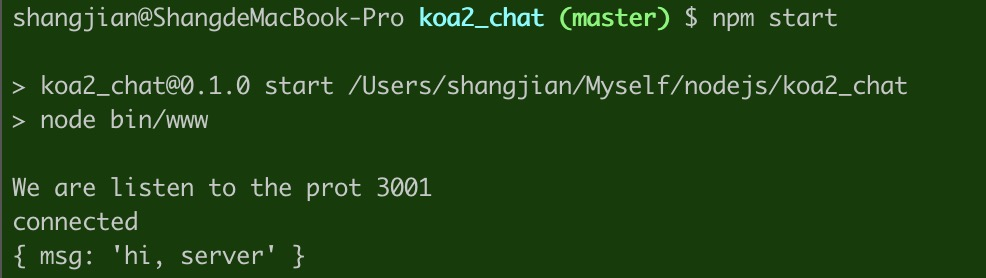

# Koa2 & Socket.IO Chat
A simple chat demo for socket.io & koa2

## How to use
```js
$ npm install
$ npm start
```

The server will listen to the port 3001.


Open the `index.html` in the root path via Chrome, then you can see the output in the console log.
